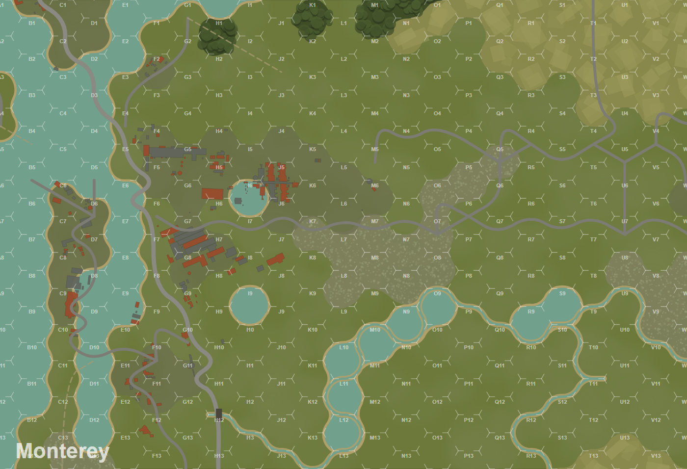
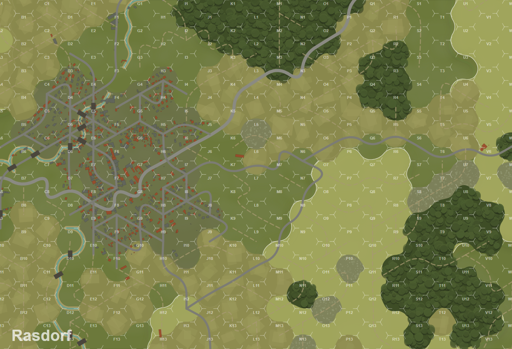

# Mapforge

**Live Sites app:** <https://mapforge-waw85.srider.chatgpt.site/>

**Sites source:** [`sites-app/`](sites-app/)

Point a board-sized window at anywhere on Earth and get a *World at War 85* hex map out of it.

Real elevation and real OpenStreetMap features go in; a 23 × 13 hex board with terrain, hills, roads, rivers and bridges comes out, as a layered SVG plus a project file you can reload.



*Monterey Bay, California — 2.86 × 1.95 km, generated from SRTM elevation and OSM vectors.*



*Rasdorf, Hesse — the same pipeline on rolling German countryside, board rotated 25°.*

---

## Quick start

Node 18+. No dependencies to install — there aren't any.

```bash
node server.js
```

Then open <http://localhost:8790>: drag the footprint around the map, set the orientation, work the hill sliders, hit **Make the board**.

Headless:

```bash
node cli.js --lat 50.7180 --lon 9.9100 --bearing 0 --name Rasdorf --out out/rasdorf
```

Writes `out/rasdorf.svg` and `out/rasdorf.json`. Optional tuning flags: `--minRelief`, `--hillHigh`, `--hillLow`, `--reliefWeight`.

```bash
node verify.js
```

Checks that the generated artwork still agrees with the hex state it came from — see *Why verify.js exists* below.

## The grid

Measured off the published boards and cross-checked against the VASSAL module's own grid definition:

| | |
|---|---|
| Board image | 3864 × 2638 px |
| Hex | flat-top, 234.03 px across the points, 202.90 px across the flats |
| Column pitch / row pitch | 175.52563 px / 202.90 px |
| Origin (hex A1 centre) | (3, 100.9) |
| Addressing | columns A–W, rows 1–13 |
| Ground scale | 150 m per hex, 0.7393 m/px |
| Board covers | 2.86 × 1.95 km |

Hex centres are at `cx = 3 + 175.52563·i`, `cy = −102 + 202.9·j + (i odd ? 101.45 : 0)`. Every neighbour's centre is 202.8 px away in all six directions — that single distance is the 150 m.

Columns A and W are half-columns, shared with the boards either side; in odd columns the top and bottom rows are half-hexes shared with the boards above and below. That is what makes the sheets geomorphic, and it is why multi-board maps must be generated as one continuous hex field and then sliced, never board by board.

## How it works

```
elevation  AWS Terrain Tiles (terrarium encoding), decoded in-process
features   OpenStreetMap via Overpass — roads, waterways, coastline,
           water bodies, landuse, buildings
   |
   +-- resample the DEM into board pixel space
   +-- detrend against a ~1.4 km low-pass surface  ->  local relief
   +-- cast 24 rays per hex to 1.8 km              ->  viewshed dominance
   +-- hysteresis threshold, then hex-lattice morphology
   +-- OSM polygons sampled 19 points per hex      ->  base terrain
   +-- roads chained into runs, rivers snapped to hexsides
   +-- grow organic outlines, verify, render 14 SVG layers
```

### Hills are a segmentation problem, not a contouring one

WaW85 has no elevation axis. Ground units sit at unit height 0, or 2 on a hill, or −1 in water — that is the whole range. The heights on the Terrain Effects Chart are an ordinal ladder for arbitrating line of sight, not metres: nap-of-earth helicopters sit at exactly the hex's obstacle height, hovering is +1 and flying is +2 above whatever is in that hex, and smoke is 20.

So "where are the hills" is not *where is the ground above some altitude*. It is *which ground commands the sight lines* at 150 m per hex. Mapforge answers it by blending detrended local relief with viewshed dominance, seeding on confident hexes and growing into connected ground that clears a lower bar. A uniform regional slope masks nothing and stays flat; an 8 m rise on an otherwise level plain genuinely masks at 1.5 km and becomes a hill.

`--reliefWeight` slides between the two signals. `--minRelief` is an absolute floor that stops flat country from growing hills at all.

### Why verify.js exists

A hex is a hill hex because its **centre is inside the contour line** — the artwork is what the rules read. But the artwork is organic: outlines get pushed out, corner-cut and given a hand-drawn wobble, none of which respects hex boundaries.

So every generated outline is tested against the hex state it came from, and the noise is backed off until it holds. A component with enclosed holes has to be judged as one even-odd shape, not ring by ring — getting that wrong silently swallowed 104 hexes on the first pass. `verify.js` walks every terrain class on several sites and fails loudly if any hex centre ends up on the wrong side of its own outline.

## Output

**SVG** — 14 top-level `<g id="...">` layers in the printed draw order: ground, hill, hill-contours, cultivated, rough, built-up, woods, water, rivers, buildings, roads, bridges, grid, labels, sheet-id. Each maps one-to-one onto a layer for further work.

**JSON project file** — per-hex terrain, hill flag, obstacle and unit heights, plus real elevation, relief and dominance for every hex; the road graph as hexside pairs; rivers as hex-vertex chains. Everything needed to reload, edit, or drive a rules engine.

The grid is drawn the way the printed sheets draw it: not as continuous hex outlines but as three ~30 px spurs at every vertex, leaving the middle of each hexside bare. That detail is most of what makes a generated board read as one of these boards.

## Known limitations

- Elevation comes from a merged SRTM-derived source, which is closer to a surface model than bare earth. Dense forest canopy can bias the hill detection upward. A true DTM — FABDEM, or a national LiDAR product — would be better, and matters more than it sounds because woods already contribute their own obstacle height separately.
- Single-hex water bodies render as lone hexagons rather than connected channels.
- The built-up threshold is tuned loosely and over-reads European villages with scattered farm buildings.
- Trails exist in the rules but are not on any published board, so the mapping from OSM `track` is a guess.
- Overpass is a shared free service and will rate-limit you. Results are cached on disk under `cache/`.

## Data sources

- Elevation: [AWS Terrain Tiles](https://registry.opendata.aws/terrain-tiles/) (public domain / various, see registry).
- Features and basemap: [OpenStreetMap](https://www.openstreetmap.org/copyright), © OpenStreetMap contributors, ODbL.

**If you deploy this publicly**, the basemap proxy must not point at `tile.openstreetmap.org` — their tile usage policy does not permit proxying tiles to third parties. Set `TILE_URL` to a provider that does:

```bash
TILE_URL='https://{your-provider}/{z}/{x}/{y}.png' TILE_ATTRIBUTION='© Someone' node server.js
```

`PORT` and `HOST` are also environment-configurable. The server carries per-client rate limits and a concurrency cap because generating a board is seconds of CPU and tens of megabytes of upstream traffic.

## Legal

*World at War 85* is a product of Lock 'n Load Publishing. This project is not affiliated with or endorsed by them.

**No game assets are included in this repository** — no rules text, no board art, no counters. The grid geometry was derived from the freely distributed VASSAL module's own published grid definition for interoperability, and the terrain vocabulary is described here the way any set of game rules can be described. You need your own copy of the game for any of this to be useful.

## Licence

MIT — see [LICENSE](LICENSE).

Copyright © 2026 Stephen G. Rider. If you reuse or customize the project, keep
the copyright and license notice and credit Stephen G. Rider. Contact:
<rider.sg@gmail.com>.
